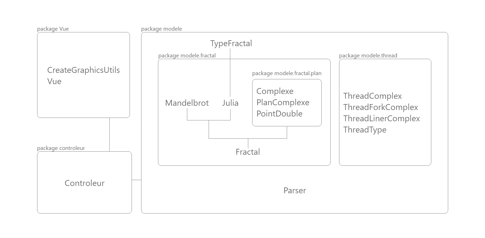

# Informations générales
Projet fractales 2021 - 2022
* Benakli Rabha William 21960601
* Andrawos Saad David 21955132

# Compilation du projet
 Depuis le repertoire `/src` de notre projet lancer la commande: `javac Main.java`.

# Lancement du projet
 Depuis le repertoire `/src` lancer la commande: `java Main [liste d'options]`.
 Si aucune option n'est entrée alors un manuel s'affichera.
 
# Liste des options existantes
Différents usages (l'option -r ne peut pas être utilisé avec d'autres options):
* `java Main [-d=directory] [-t=type] [-g=generator] [-c=color] [-s=size] [-p=plan] [-f=iteration] [-e=ensemble]`
* `java Main [-r=read]` 
* `java Main [-i=gui]`

| nom         | explication                                                                                                            | exemple                                                       |
|-------------|------------------------------------------------------------------------------------------------------------------------|---------------------------------------------------------------|
| directory   | Permets de choisir le nom du fichier (sans son extension) dans lequel la fractale va être générée.                     | -d=string (avec string, un nom de fichier)                    |
| type        | Permets de choisir le type de fractale à générer.                                                                      | -t=x+yi (avec x et y des décimaux)                            |
| generator   | Permets de choisir une méthode de génération de fractales. Multi thread, single thread ou bien encore en ForkJoinPool. | -g=THREADBASIC (ou -g=FORKJOINPOOL ou -g=LINEARTHREAD)        |
| color       | Permets de choisir une couleur de base pour la colorisation de la fractale.                                            | -c=x (avec x, un entier compris entre 0 et 360)               |
| size        | Permets de choisir le pas utilise pour générer la fractale.                                                            | -s=x (avec x un entier)                                       |
| read        | Permets d'importer un fichier de configuration.                                                                        | -r=string (avec string, un nom de fichier)                    |
| gui         | Permets de choisir entre une utilisation graphique et en ligne de commande.                                            | -i=true (ou -i=false)                                         |
| plan        | Permets de choisir la dimension du plan complexe.                                                                      | -p=(x1,y1);(x2,y2) (avec x1,y1 et x2,y2 des entiers décimaux) |
| iteration   | Permets de changer le nombre d'itérations maximum pour calculer l'indice de divergence de chaque point du plan.        | -i=x (avec x un entier)                                       |
| ensemble    | Permets de choisir l'ensemble de la fractale à générer.                                                                | -e=JULIA (ou -e=MANDELBROT)                                   |
| number      | Permets de gérer le nombre de Thread qui va calculer la fractale.                                                      | -e=x (avec x un entier)                                       |

## Ligne de commande
Pour générer une image en ligne de commande, il suffit de lancer la commande `java Main -i=false` suivi d'autres options si les paramètres par défaut ne sont pas ceux voulus.

## Interface graphique
Pour lancer l'interface graphique, il suffit de lancer la commande `java Main` ou bien `java Main -i=true` depuis le répertoire `/src`.

# Choix techniques

Nous avons implémenté différentes techniques, vu ce semestre et l'année dernière, lors de notre projet;

1- La structure initiale : 

	Tout d'abord un travail sur la structure nous a permis d'organiser le code:
	
	-Nous avons utilisé le patron MVC pour réaliser ce projet. Il est très utile lorsque nous devons mêler interface graphique et programme.
	
	-Le choix d'avoir une classe abstract "Fractal" scellée permet dans un premier temps d'utiliser le polymorphisme pour
	exécuter des fonctions override par chacune des classes filles (qui ont la permission d'étendre Fractal).
	Pour limiter toutes confusions ces classes filles sont dites "final" et ne peuvent être étendues à leur tour. Cela permet de
	garantir l'intégrité de la classe "Fractal".

	-Avoir plusieurs enum nous semblait pertinent. Nous pouvions premièrement conserver une liste de fractale de l'ensemble
	de julia, mais aussi avoir un choix de type de méthode pour exécuter les threads (par exemple : ForkJoinPool, Thread basique etc...)

	-Pour l'IG, en particulier pour les actions effectuées par les buttons. 
	 Nous avons utilisé principalement des lambdas expressions.
	
	-La majorité de nos classes sont immuables. Nous avons décidé dans ce sens de recréer des objets 
    à chaque fois que nous mettons à jour l'objet. Par conséquent il n'y a pas de setteur dans nos classes (sauf Parser).
	
	-Nous avons aussi ajouté les fabriques statiques dans nos classes Complex, PlanComplex et PointDouble.
	Par ailleurs nous avons fait le choix de recréer un objet PointDouble plutôt que d'utiliser l'objet Point2d.Double
	que propose java. Nous avons pensé qu'il était plus sûr car nous aurions mis les attributes privés. Cela nous 
	éviterait de faire une protection défensive (comme vu en tp et en cours) 
	
2 - Choix parallèle (mais non effectué) : 

	Nous avons hésité entre plusieurs implémentations. Par exemple une interface fonctionnelle qui aurait pu être redéfinie par chaque 
	classe qui l'implémentait. Afin de réaliser une fonction d'ordre supérieur et pourvoir dans un second temps utiliser ces fonctions 
	dans complex etc... Nous avons fait le choix de ne pas le prendre car notre structure nous semblait satisfaisante pour ce projet.
	
3 - Les threads et threads parallèles: 
  
	Pour les threads nous avons implementé plusieurs techniques vues en cours. Tout d'abord un thread dit 
	basique puisqu'il s'agit d'une classe runnable modifiée. Ensuite nous avons ajouté ForkJoinPool, cette méthode
	d'utilisation des threads est différente puisqu'elle permet de diviser pour mieux régner. En effet forkjoinPool
	divise le travail tant que celui-ci ne respect pas la condition imposée. Et enfin nous avons ajouté le LinaireThread
	il s'agit en fait d'une simple exécution avec un seul thread. Toute cette diversité de thread 
	nous permet d'avoir la comparaison des différentes méthodes vues en terme de temps pour générer les fractales.

4 - Schema de la structure:

